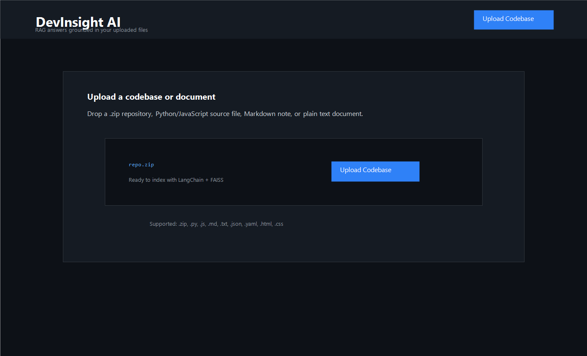
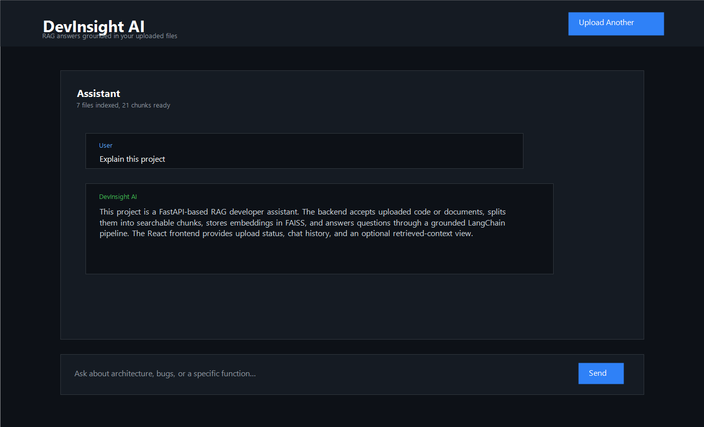
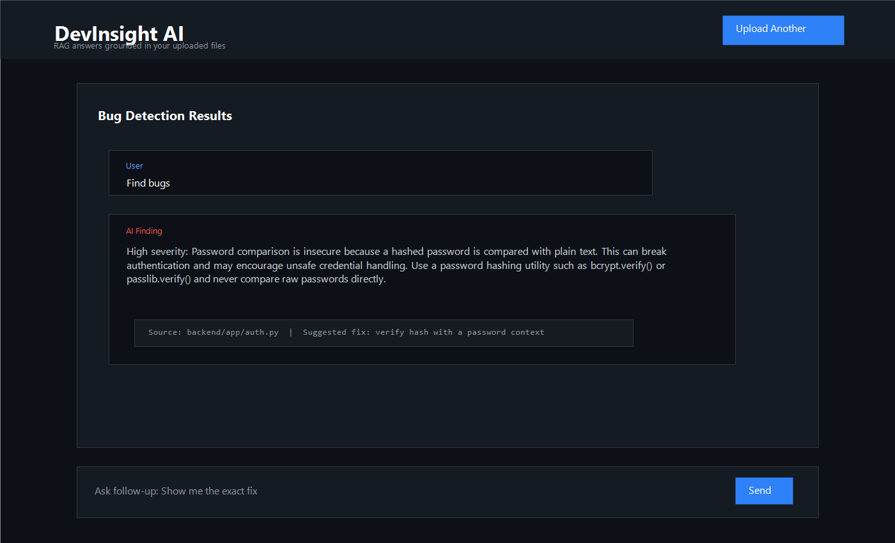

# DevInsight AI - RAG-Based Developer Assistant

[](https://github.com/pun33th45/devinsight-ai/stargazers)
[](LICENSE)


DevInsight AI is a full-stack Retrieval-Augmented Generation developer assistant. Upload a codebase or technical document, then ask practical engineering questions such as:

- "Explain this project"
- "Find bugs"
- "What does this function do?"
- "Where are the API routes defined?"

The app reads your files, chunks the content, embeds the chunks into FAISS, retrieves the most relevant context for each question, and sends that grounded context to an LLM for a structured developer-focused answer.

## Screenshots







## Tech Stack

| Layer | Technology |
| --- | --- |
| Backend | Python, FastAPI, Uvicorn |
| RAG | LangChain, RecursiveCharacterTextSplitter |
| Vector Store | FAISS |
| LLM + Embeddings | Gemini API via `langchain-google-genai` |
| Frontend | React, Vite, TailwindCSS |
| HTTP Client | Axios |
| DevOps | Dockerfile, GitHub Actions CI |

> Note: The original architecture is provider-agnostic through LangChain. This repository is currently configured for Gemini because it works without an OpenAI API key. You can swap the embedding/chat services to OpenAI if preferred.

## Architecture

```text
User -> Upload -> Chunk -> Embed -> FAISS -> Query -> Retrieve -> LLM -> Answer
```

```text
React + Tailwind UI
        |
        | Axios
        v
FastAPI API
        |
        | Load zip/source/doc files
        v
RecursiveCharacterTextSplitter
        |
        | Gemini embeddings
        v
FAISS vector index
        |
        | similarity_search(top-k)
        v
Prompt + Gemini chat model
        |
        v
Answer + retrieved source context
```

## Features

- Upload `.zip`, `.py`, `.js`, `.jsx`, `.ts`, `.tsx`, `.txt`, `.md`, `.json`, `.yaml`, `.css`, and `.html` files.
- In-memory zip processing to avoid Windows/OneDrive upload file locks.
- Structure-aware chunking with LangChain.
- Local FAISS vector storage.
- Senior-developer system prompt for architecture explanations and bug analysis.
- Optional retrieved-context toggle in the chat UI.
- Dark, responsive, recruiter-friendly interface.
- Error sanitization so API keys are not leaked in frontend messages.
- Dockerfile for backend deployment.
- GitHub Actions CI for backend import and frontend build.

## Project Structure

```text
devinsight-ai/
├── backend/
│   ├── app/
│   │   ├── routes/
│   │   ├── services/
│   │   ├── utils/
│   │   ├── config.py
│   │   └── main.py
│   ├── Dockerfile
│   ├── requirements.txt
│   └── .env.example
├── frontend/
│   ├── public/screenshots/
│   ├── src/
│   │   ├── components/
│   │   ├── api.js
│   │   └── App.jsx
│   └── package.json
├── .github/workflows/ci.yml
├── .gitignore
├── LICENSE
└── README.md
```

## Setup

### 1. Clone

```bash
git clone https://github.com/pun33th45/devinsight-ai.git
cd devinsight-ai
```

### 2. Backend

```bash
cd backend
python -m venv .venv
.venv\Scripts\activate
pip install -r requirements.txt
```

Create `backend/.env`:

```env
GOOGLE_API_KEY=your_gemini_api_key_here
```

Run the API:

```bash
uvicorn app.main:app --reload
```

Backend:

```text
http://localhost:8000
```

Health check:

```text
http://localhost:8000/health
```

Swagger docs:

```text
http://localhost:8000/docs
```

### 3. Frontend

```bash
cd frontend
npm install
npm run dev
```

Frontend:

```text
http://localhost:5173
```

## API Endpoints

### `POST /upload`

Uploads and indexes a supported source/document file or zip archive.

```json
{
  "message": "Upload indexed successfully.",
  "filename": "repo.zip",
  "documents": 12,
  "chunks": 48
}
```

### `POST /query`

Asks a question against the indexed project context.

```json
{
  "question": "Find potential bugs",
  "k": 5
}
```

Response:

```json
{
  "answer": "The project has a possible authentication issue...",
  "sources": [
    {
      "source": "app/auth.py",
      "file_type": ".py",
      "content": "..."
    }
  ]
}
```

## Docker

```bash
cd backend
docker build -t devinsight-ai-backend .
docker run --env-file .env -p 8000:8000 devinsight-ai-backend
```

## Sample Prompts

- "Explain this project"
- "Explain the architecture"
- "Find bugs"
- "What does this function do?"
- "How can this codebase be improved?"

## Future Improvements

- Multi-project indexes and index reset controls.
- Streaming responses.
- Authentication and per-user workspaces.
- Pinecone or hosted vector database option.
- GitHub repository ingestion by URL.
- Syntax-highlighted retrieved context.

## Author

Built by [Puneeth Raj](https://github.com/pun33th45).
